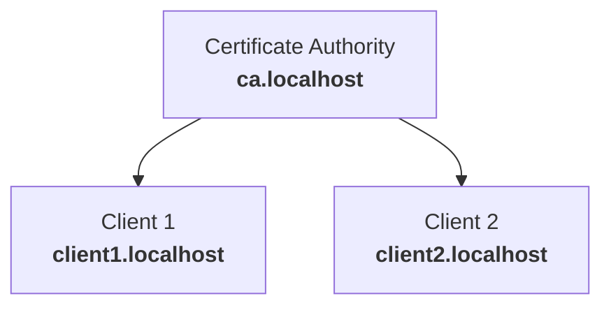

# golang-mTLS

Playing with mTLS and golang.

## Certificate Chain

Both clients need the CA cert to verify the authenticity of the certificate provided by the other client.

## Running it

Requires port 8101 to not be in use.

1. Run `bash generate_certs.sh`; you will be prompted a few times for the CA passphrase, choose a random one
2. Run the server with `go run server/server.go`
3. Run the client with `go run client/client.go`

Client and server are arbitrary descriptions here, for mTLS there is no distinction between those.